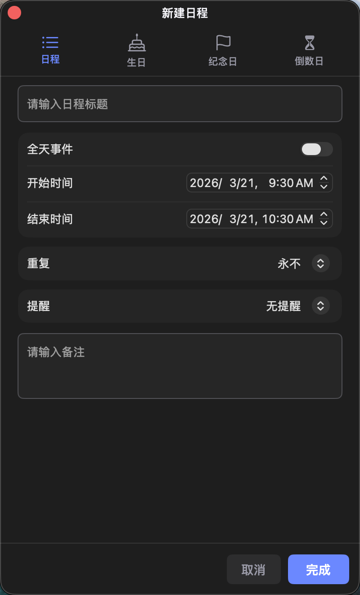
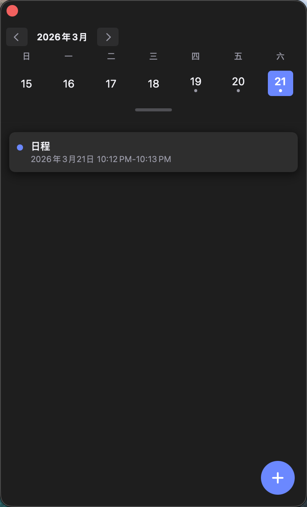
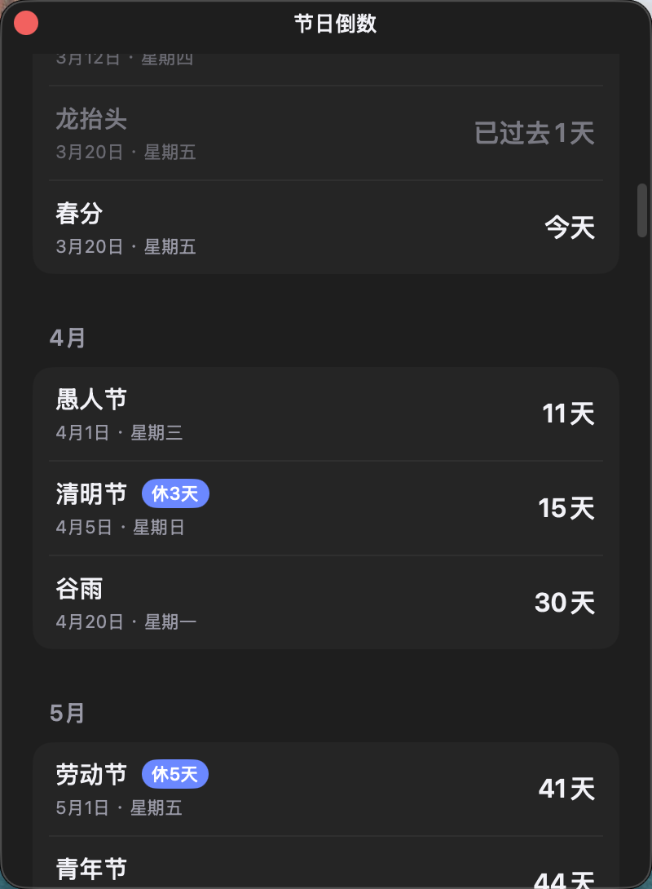

# 万年历 · 功能介绍

## 微信打赏

若你觉得这款应用有帮助，欢迎微信扫码打赏支持开发，感谢你的鼓励。

---

一款常驻 **菜单栏** 的日历应用：点击状态栏图标即可展开主面板，左侧浏览月历与日期，右侧查看时间、天气、预报与节日倒数；并支持在独立窗口中管理日程与节日提醒。

---

## 主界面 · 亮色主题

左侧为月历网格，可切换月份、点选日期；右侧展示当前时间、今日天气、环境参数、多日预报以及节日/纪念日倒数入口。支持跟随系统或手动选择 **浅色 / 深色** 外观。

---

## 主界面 · 深色主题

夜间或深色模式下，界面与背景对比更舒适，与 macOS 外观一致。

---

## 创建日程

通过「创建日程」可在独立窗口中新建事件：选择日期与时间、标题与备注等，便于快速记录而不遮挡主日历。

---

## 日程列表

在指定日期查看当日日程列表，便于集中浏览与后续编辑（可从日历或相关入口打开）。

---

## 节日倒数

「节日倒数」以独立窗口展示临近节日与纪念日，支持滚动浏览；可从主面板相关区域进入，方便随时查看距离重要日期的天数。

---

## 其他说明

- **状态栏**：图标旁可显示当前日期（如「MM月dd日」），左键打开主面板，右键可进入设置、检查更新或退出应用。
- **天气与背景**：右侧面板可根据天气与昼夜展示动态背景（可在设置中调整相关选项）。

如需更多选项，请使用菜单栏 **右键 → 设置** 打开应用设置窗口。
